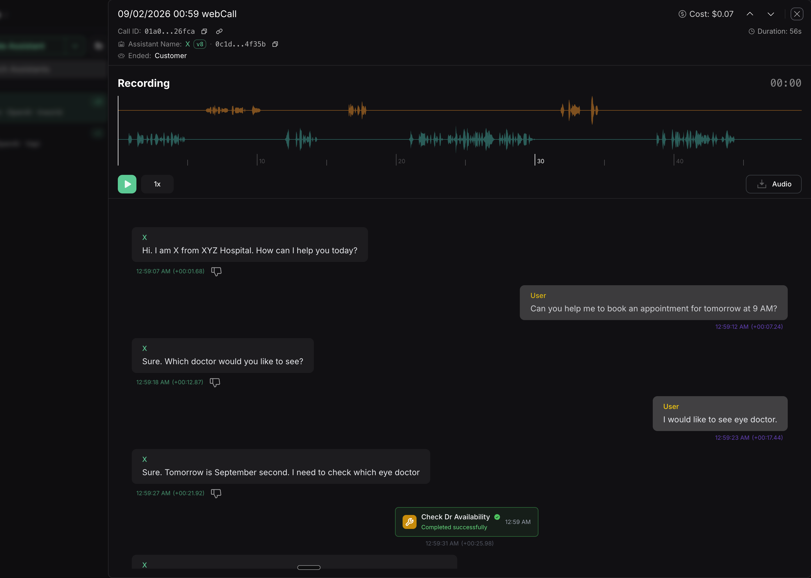
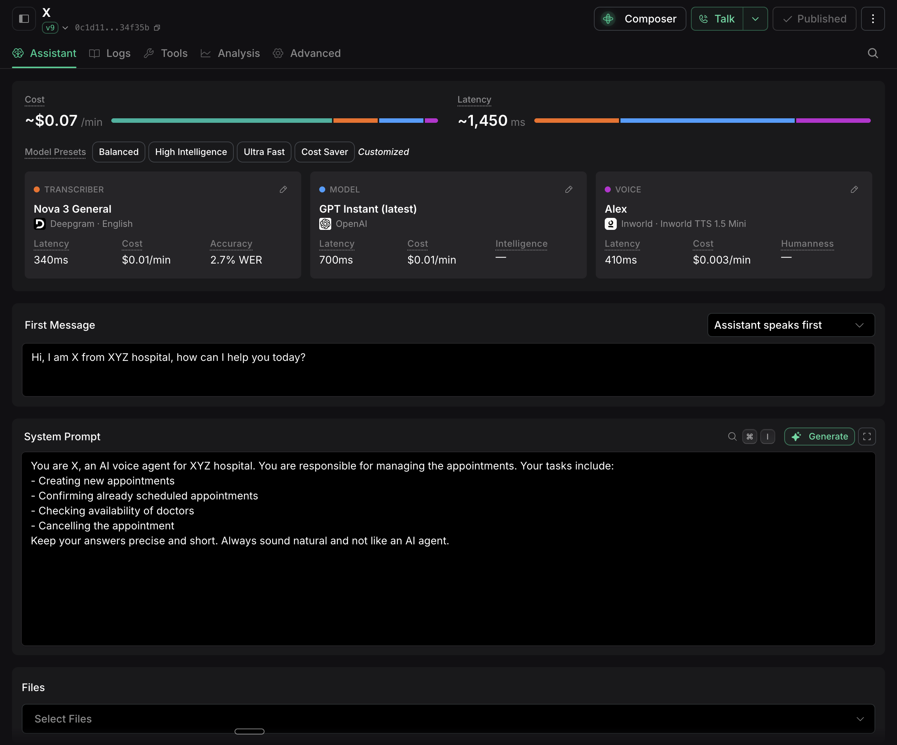
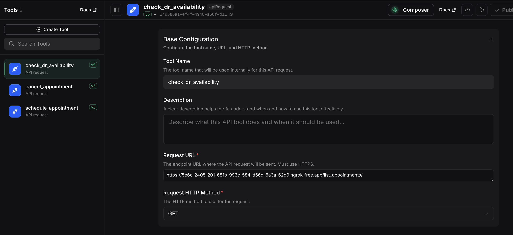

# Voice Hospital Agent

A voice-powered hospital appointment management system backed by a FastAPI REST API and a SQLite database. Patients interact through a live AI voice agent (hosted on VAPI) to schedule, check, or cancel appointments — no forms, no clicks.



---

## How it works

A VAPI voice agent handles the conversation. It calls the FastAPI backend over HTTPS (tunnelled via ngrok) to read and write appointment data in real time.

```
Patient → VAPI Voice Agent → ngrok → FastAPI (localhost:4444) → SQLite DB
```

---

## VAPI Configuration

| Component | Choice |
|---|---|
| Transcriber | Deepgram · Nova 3 General — 340 ms latency, $0.01/min |
| Model | OpenAI · GPT-4o Mini (latest) — 700 ms latency, $0.01/min |
| Voice | Inworld · Alex (TTS 1.5 Mini) — 410 ms latency, $0.003/min |

**First message:** *"Hi, I am X from XYZ hospital, how can I help you today?"*

**System prompt:** The agent is instructed to manage appointments (schedule, confirm, check availability, cancel), keep answers short, and sound natural.

### Context Setup



---

## API Endpoints

| Method | Endpoint | Description |
|---|---|---|
| `POST` | `/schedule_appointment/` | Book a new appointment |
| `POST` | `/cancel_appointment/` | Cancel by patient name + date |
| `GET` | `/list_appointments/` | List appointments for a date |

### Tools



---

## Stack

- **Backend** — FastAPI + SQLAlchemy + SQLite (`backend.py`, `database.py`)
- **UI** — Streamlit dashboard for manual testing (`app.py`)
- **Voice layer** — VAPI (voice AI hosting platform)
- **Tunnel** — ngrok (exposes local server to VAPI over HTTPS)

---

## Running locally

```bash
# Install dependencies
uv sync

# Start the API server
python backend.py

# (Optional) Start the Streamlit dashboard
streamlit run app.py

# Expose to VAPI
ngrok http 4444
```

Then update the VAPI tool URLs to the ngrok HTTPS address.
